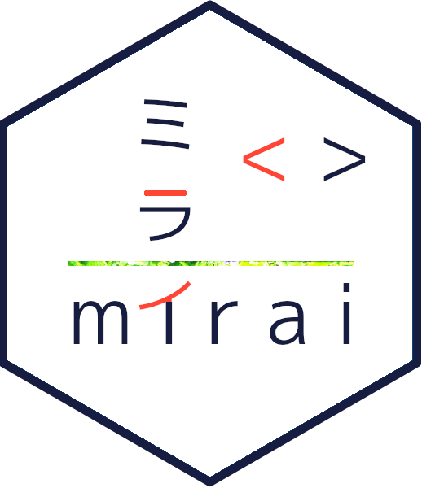

<!-- README.md is generated from README.Rmd. Please edit that file -->

# mirai <a href="https://mirai.r-lib.org/" alt="mirai"></a>

<!-- badges: start -->

[](https://CRAN.R-project.org/package=mirai)
[](https://r-lib.r-universe.dev/mirai)
[](https://github.com/r-lib/mirai/actions/workflows/R-CMD-check.yaml)
[](https://app.codecov.io/gh/r-lib/mirai)
[](https://zenodo.org/badge/latestdoi/459341940)
<!-- badges: end -->

### ミライ

<br /> みらい 未来 <br /><br /> Minimalist Async Evaluation Framework
for R <br /><br /> → Designed for simplicity, a ‘mirai’ evaluates an R
expression asynchronously in a parallel process, locally or distributed
over the network.

→ Modern networking and concurrency, built on
[nanonext](https://github.com/r-lib/nanonext/) and
[NNG](https://nng.nanomsg.org/), ensures reliable scheduling over fast
inter-process communications or TCP/IP secured by TLS.

→ Launch remote resources via SSH or cluster managers for distributed
computing.

→ Scales efficiently to millions of tasks over thousands of connections,
requiring no storage on the file system due to its inherently queued
architecture.

→ Innovative features include event-driven promises, asynchronous
parallel map, and seamless serialization of otherwise non-exportable
reference objects. <br /><br />

### Quick Start

mirai is Japanese for ‘future’ and is an implementation of *futures* in
R.

→ `mirai()`:

Sends an expression to be evaluated asynchronously in a separate R
process and returns a mirai object immediately. Creation of a mirai is
never blocking.

The result of a mirai `m` will be available at `m$data` once evaluation
is complete and its return value is received. `m[]` may be used to wait
for and collect the value.

``` r
library(mirai)

m <- mirai(
  {
    # slow operation
    Sys.sleep(2)
    sample(1:100, 1)
  }
)

m
#> < mirai [] >
m$data
#> 'unresolved' logi NA

# do other work

m[]
#> [1] 86
m$data
#> [1] 86
```

→ `daemons()`:

Sets persistent background processes (*daemons*) where mirai are
evaluated.

To launch 6 local daemons:

``` r
daemons(6)
#> [1] 6
```

To launch daemons over the network for distributed computing, this is
supported via:

- SSH
- HPC cluster resource managers (for Slurm, SGE, Torque, PBS, LSF)

See the [reference
vignette](https://mirai.r-lib.org/articles/mirai.html) for further
details.

→ `mirai_map()`:

Maps a function over a list or vector, with each element processed as a
mirai. For a dataframe or matrix, it automatically performs multiple map
over the rows.

A ‘mirai_map’ object is returned immediately, and is always
non-blocking.

Its value may be retrieved using its `[]` method, returning a list. The
`[]` method also provides options for flatmap, early stopping and
progress indicators.

``` r
df <- data.frame(
  fruit = c("apples", "oranges", "pears"),
  price = c(3L, 2L, 5L)
)

m <- df |>
  mirai_map(\(...) sprintf("%s: $%d", ...))
m
#> < mirai map [0/3] >
m[.flat]
#> [1] "apples: $3"  "oranges: $2" "pears: $5"
```

### Design Concepts

mirai is designed from the ground up to provide a production-grade
experience.

→ Fast

- 1,000x more responsive vs. common alternatives
  [<sup>\[1\]</sup>](https://github.com/r-lib/mirai/pull/142#issuecomment-2457589563)
- Built for low-latency applications e.g. real time inference & Shiny
  apps

→ Reliable

- No reliance on global options or variables for consistent behaviour
- Explicit evaluation for transparent and predictable results

→ Scalable

- Launch millions of tasks over thousands of connections
- Proven track record for heavy-duty workloads in the life sciences
  industry

### Powering the Ecosystem

mirai features the following core integrations, with usage examples in
the linked vignettes:

[](https://mirai.r-lib.org/articles/v04-parallel.html)
  Provides the first official alternative communications backend for R,
implementing the ‘MIRAI’ parallel cluster type, a feature request by
R-Core at R Project Sprint 2023.

[](https://purrr.tidyverse.org)
  Powers parallel map for the purrr functional programming toolkit, a
core tidyverse package.

[](https://mirai.r-lib.org/articles/v02-promises.html)
  Implements next generation, event-driven promises. ‘mirai’ and
‘mirai_map’ objects are readily convertible to ‘promises’, and may be
used directly with the promise pipe.

[](https://mirai.r-lib.org/articles/v02-promises.html)
  The primary async backend for Shiny, supporting ExtendedTask and the
next level of responsiveness and scalability for Shiny apps.

[](https://mirai.r-lib.org/articles/v02-promises.html)
  The built-in async evaluator behind the `@async` tag in plumber2; also
provides an async backend for Plumber.

[](https://mirai.r-lib.org/articles/v03-serialization.html)
  Allows Torch tensors and complex objects such as models and optimizers
to be used seamlessly across parallel processes.

[](https://mirai.r-lib.org/articles/v03-serialization.html)
  Allows queries using the Apache Arrow format to be handled seamlessly
over ADBC database connections hosted in background processes.

[](https://docs.ropensci.org/targets/)
  Targets, a make-like pipeline tool, uses crew as its default
high-performance computing backend. Crew is a distributed worker
launcher extending mirai to different computing platforms, from
traditional clusters to cloud services.

### Thanks

We would like to thank in particular:

[Will Landau](https://github.com/wlandau/) for being instrumental in
shaping development of the package, from initiating the original request
for persistent daemons, through to orchestrating robustness testing for
the high performance computing requirements of crew and targets.

[Joe Cheng](https://github.com/jcheng5/) for integrating the ‘promises’
method to work seamlessly within Shiny, and prototyping event-driven
promises.

[Luke Tierney](https://github.com/ltierney/) of R Core, for discussion
on L’Ecuyer-CMRG streams to ensure statistical independence in parallel
processing, and making it possible for mirai to be the first
‘alternative communications backend for R’.

[Travers Ching](https://github.com/traversc) for a novel idea in
extending the original custom serialization support in the package.

[Henrik Bengtsson](https://github.com/HenrikBengtsson/) for valuable
insights leading to the interface accepting broader usage patterns.

[Daniel Falbel](https://github.com/dfalbel/) for discussion around an
efficient solution to serialization and transmission of torch tensors.

[Kirill Müller](https://github.com/krlmlr/) for discussion on using
parallel processes to host Arrow database connections.

### Installation

Install the latest release from CRAN:

``` r
install.packages("mirai")
```

The current development version is available from R-universe:

``` r
install.packages("mirai", repos = "https://r-lib.r-universe.dev")
```

### Links & References

◈ mirai R package: <https://mirai.r-lib.org/> <br /> ◈ nanonext R
package: <https://nanonext.r-lib.org/>

mirai is listed in CRAN High Performance Computing Task View: <br />
<https://cran.r-project.org/view=HighPerformanceComputing>

–

Please note that this project is released with a [Contributor Code of
Conduct](https://mirai.r-lib.org/CODE_OF_CONDUCT.html). By participating
in this project you agree to abide by its terms.
